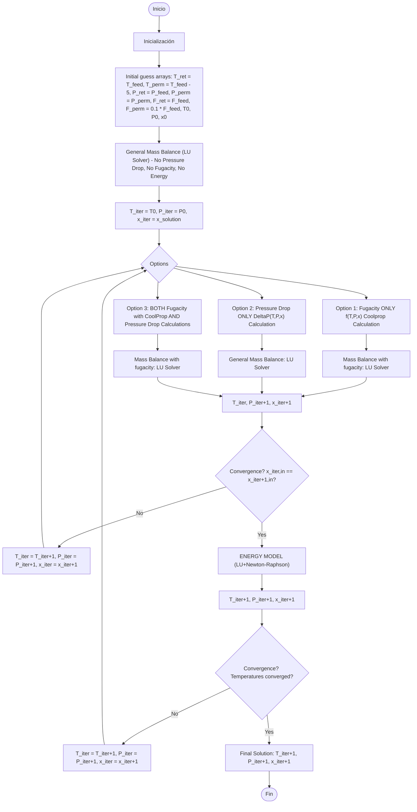

# Hollow Fiber Membrane (HFM) Gas Permeation Simulator

**Version 0.5.0**

[](https://www.python.org/downloads/)
[]()

---

## Description

HFM-Simulator is a comprehensive Python library for simulating hollow fiber membrane (HFM) modules. The simulator solves coupled mass and energy balance equations for gas separation processes through hollow fiber membranes, supporting both isothermal and non-isothermal operations with optional pressure drop and fugacity calculations.

---

## 🚀 What's New in v0.5.0

This release is about **convergence correctness**. Profiling the solver instead
of inspecting it uncovered two defects that had been silently shaping results.

* **⚠ Branch 3 convergence fix (affects results, not just speed).** The
  fugacity + pressure-drop branch damped the flows but took a *full,
  undamped* Picard step on the pressure. Since the bore pressure drop is
  roughly quadratic in the permeate flow, the two updates fought each other
  and narrow-bore candidates fell into a **period-2 limit cycle** — the outer
  error bouncing (0.77, 0.18, 0.71, 0.18, …) forever with no trend. Those
  candidates exhausted `max_num_iterations`, raised `SimulationNotConverged`,
  and were therefore treated as **infeasible although they are perfectly
  viable**. The pressure is now relaxed with the same alpha as the flows
  (`BRANCH3_RELAX_PRESSURE`). Candidates that never converged now solve in
  ~0.1 s; well-behaved ones go from 37 to 22 outer iterations and land on the
  same fixed point (agreement 5e-07, i.e. the loop tolerance itself).
  **Any optimization run made with these flags should be repeated.**
* **Marching solver: convergence tests where there were none.** Phase 1 ran a
  fixed 120 damped-Picard sweeps with *no convergence test at all*, reaching
  machine precision around sweep 40–80 and then grinding on — 83 % of all
  marches — while phase 2's Anderson acceleration, having nothing left to do,
  performed a single sweep and exited. Both phases now stop when converged or
  provably stalled: 8130 → 2570 marches, 12.3 s → 4.1 s, result identical to
  2.8e-14.
* **Tolerances now derive from `iteration_tolerance`.** `solve_marching_fast`
  was called with no arguments at both call sites, so it always ran on a
  hardcoded `tol = 1e-11` — up to 100 000x tighter than the loop consuming its
  result. It now uses `MARCH_TOL_FRACTION x iteration_tolerance`. Note this is
  a *composition* residual (dimensionless) and is deliberately **not** derived
  from `inner_tol`, which is an absolute component flow in mol/s.
* **Solver observability (`results.outer_diag`, `results.march_exit`).** Both
  defects above were invisible to code review and obvious the moment the
  iterates were logged. Loops now report *how* they ended: each marching phase
  as `converged`/`stalled`/`exhausted`, and the outer loop classified as
  `oscillating` (a limit cycle — no iteration budget will fix it), `stalled`
  or `descending`. The label is embedded in the `SimulationNotConverged`
  message, so a failed candidate says how it failed.
* **Per-candidate wall-clock budget** (`Simulation_Deadline`) for enumeration
  runs, honoured cooperatively by every solver rung.
* **Packaging fix:** `openpyxl` is now declared (spreadsheet export raised
  `ImportError` on a clean install); `pandas` was declared but never imported
  and has been dropped.

### 📜 Previous Release Highlights (v0.4.2)

* **Matrix-Based Solvers (LU & Newton-Raphson):** All mass balances solved using LU Matrix fixed-point algorithms, with a Newton-Raphson energy balance.
* **Warm Start for Set-Trimming Optimization:** Initialization mechanism that reuses previous convergence states, cutting time in optimization loops.
* **Performance Profiling & Solver Trade-offs:** Faster for linear cases and standalone mass balances; the residual-based solvers remained more robust for strongly non-linear, fully coupled models. The solver ladder of v0.5.0 supersedes this trade-off by falling through automatically.

### 📜 Previous Release Highlights (v0.4.1)
* **Unified Reporting:** Consolidated mass and energy balance reports into a single `Simulator_Results_HFM.py` module.
* **New Marching Solver (Legacy):** Introduced a marching solver for highly non-ideal mixtures (now optimized/replaced in v0.4.2 for linear cases).
* **Automated Validation:** Added `help/Simulator_Examples/VALIDATOR.py` for combinatorial testing and mesh-independence sweeps.
* **Bug Fixes:** Fixed critical reference mutation in `FFFeed_total` and protected initial guesses against negative values.

---

## Features

- **Mass Balance Models**: 
  - Without pressure drop (simplified model).
  - With pressure drop (advanced model using hydraulic correlations).
  - With fugacity calculation (optional for non-ideal thermodynamics).

- **Energy Balance**: 
  - Coupled heat transfer between retentate and permeate streams.
  - Temperature profile calculation along the module.
  - Overall heat transfer coefficient calculation (Coker, 1999).

- **Thermodynamic Properties**:
  - Integration with CoolProp for accurate property calculations.
  - Support for multi-component mixtures.
  - Enthalpy, viscosity, density, and thermal conductivity calculations.

- **Numerical Methods**:
  - Sparse Jacobian matrices for computational efficiency.
  - Least-squares solver with trust-region reflective algorithm.
  - Analytical and finite-difference Jacobian options.

- **Post-processing**:
  - Excel export for mass and energy balance results.
  - Component-specific flux and composition profiles.
  - Dew point temperature calculations.

## Installation

### Requirements

- Python 3.10 or higher
- pip package manager
- Common_Library installed for properties calculations and streams setting

### Install from source

    git clone <repository-url>
    cd HFM_Library
    pip install -e .

### Dependencies

The package requires the following dependencies (installed automatically):

- `numpy` - Numerical computations
- `scipy` - Sparse linear algebra and `least_squares`
- `openpyxl` - Excel export in `Simulator_Results_HFM`
- `Common-Library` - Streams, membrane permeance and mixture properties
- `CoolProp` - Thermophysical properties (transitive, via Common-Library)

Two corrections in 0.5.0: `openpyxl` is a direct import of
`Simulator_Results_HFM` but was **not declared**, so `export_to_excel` raised
`ImportError` on a clean install. `pandas` was declared but is not imported
anywhere in `src/` — it is used by `Calculations_HFM_Simulation_Results.py`,
which sits outside this package and should declare it itself.

## 📂 Project Structure

```text
Simulator_HFM/
│   Simulator_Geometry_HFM.py
│   Simulator_Results_HFM.py      # pure data container + reporting
│   Simulator_Run_HFM.py          # orchestration and the outer loops
│   Simulation_Deadline.py        # cooperative per-candidate wall-clock budget
│
├───Calculations/                 # 📐 Pre-simulation analysis & set-trimming
│      Calculations_HFM_Area.py
│      Calculations_HFM_dP_Bore.py
│      Calculations_HFM_dP_Shell.py
│      Calculations_HFM_Mach_Bore.py
│      Calculations_HFM_Mach_Shell.py
│      Calculations_HFM_Max_Area_Loss.py
│      Calculations_HFM_Min_Area_XR_Comp.py
│      Calculations_HFM_Min_Thickness.py
│      Calculations_HFM_Nf.py
│      Calculations_HFM_Reynolds_Bore.py
│      Calculations_HFM_Reynolds_Shell.py
│      Calculations_HFM_Simulation_Results.py
│      Calculations_HFM_Velocity_Fiber.py
│      Calculations_HFM_Velocity_Shell.py
│      Spec_Consistency_HFM.py
│
├───Energy_Balance_HFM/
│      Energy_Balance_HFM.py
│      Energy_Balance_Solver_HFM.py
│      U_Calculation.py
│
├───Equipment_Simulator_HFM/
│      Equipment_HFM.py           # HFMMembrane UnitOperation wrapper
│      README.md                  # Port assignment & flowsheet bridge
│
└───Mass_Balance_HFM/
       Mass_Balance_Solver_HFM.py                 # the solver ladder
       Mass_Balance_Without_Pressure_Drop_HFM.py
       Mass_Balance_With_Fugacity_HFM.py
```

> **New in v0.5.0:** The `Calculations/` folder contains pre-simulation analysis modules for **set-trimming optimization**. These modules evaluate geometric and physical constraints (Reynolds, Mach, area, thickness, velocity, etc.) to discard infeasible candidates *before* running the expensive membrane simulation, dramatically reducing computational cost in enumeration campaigns.

---

## 🏗️ Equipment Simulator

### `Equipment_Simulator_HFM/`

The `Equipment_Simulator_HFM` sub-package contains the `HFMMembrane` class, a `UnitOperation` wrapper that bridges the internal axial membrane solver with the `Process_Simulator` flowsheet engine.

**Key class:** `HFMMembrane`

- Exposes three ports to the flowsheet: `feed`, `retentate`, `permeate`.
- Wraps a fully configured `SimulatorRunHFM` instance.
- At solve time: feeds the inlet stream, runs the internal solver, extracts exit conditions from axial profiles, and writes them to outlet streams.
- Stores diagnostics: stage cut, solver path, molar flows.

**Usage pattern:**

```python
from Simulator_HFM.Equipment_Simulator_HFM.Equipment_HFM import HFMMembrane

hfm = HFMMembrane(
    name="HFM1",
    simulator=sim,           # fully configured SimulatorRunHFM
    tag="ME-101",
    description="CO2 separation stage",
)

# Add to flowsheet, connect ports, solve via SequentialSolver
```

📄 [Full documentation → `Equipment_Simulator_HFM/README.md`](Equipment_Simulator_HFM/README.md)

---

## ⚡ Quick Start

Below is a complete, self-contained example to set up and run a simulation from scratch without relying on external scenario files. This example simulates a binary CO2/CH4 mixture.

```python
import numpy as np
from Simulator_HFM.Simulator_Run_HFM import SimulatorRunHFM
from Simulator_HFM.Simulator_Geometry_HFM import SimulatorGeometryHFM
from Common.Stream.stream import Stream, ThermoBackend
from Common.Membrane_Properties.Permeance.Membrane_Permeance import MembranePermeance

def main():
    # 1. Define Feed Stream
    #    Note: Stream only accepts composition, P, T, and ONE flow spec.
    #    Viscosity and molar mass are derived internally via CoolProp.
    feed = Stream(
        composition={"CO2": 0.1, "CH4": 0.9},
        P=35e5,              # [Pa] Feed pressure
        T=308.0,             # [K] Feed temperature
        molar_flow=0.35,     # [mol/s] Total feed flow
        backend=ThermoBackend.HEOS,
    )

    # 2. Define Membrane Properties (Permeance)
    #    Note: You can also define Permeability (S) + thickness instead of Permeance (Q)
    permeance = MembranePermeance(
        components=["CO2", "CH4"],
        permeance=np.array([3.207e-9, 1.33e-10])  # [mol/(m2 Pa s)]
    )

    # 3. Define Geometry
    geometry = SimulatorGeometryHFM(
        LSingleMembrane=0.6,          # [m] Fiber length per element
        DiamShell=0.1,                # [m] Shell diameter
        DiamFiber_o=250e-6,           # [m] Outer fiber diameter
        DiamFiber_i=200e-6,           # [m] Inner fiber diameter
        NFibers=60000,                # [] Number of fibers
        Void_Frac=0.625,              # [] Void fraction
        NCells=20,                    # [] Number of finite volume discretizations
        NumberOfMembranesInSerie=1,   # [] Elements in series
        NumberOfTubesInParallel=1,    # [] Tubes in parallel
    )

    # 4. Configure and Run Simulator
    sim = SimulatorRunHFM()
    sim.set_feed(feed)
    sim.set_membrane_permeance(permeance)
    sim.geometry = geometry

    # Core Simulation Flags
    sim.PPerm = 1e5                   # [Pa] Permeate side pressure
    sim.energy = True                 # Enable energy balance
    sim.pressure_drop = True          # Enable pressure drop (Hagen-Poiseuille)
    sim.force_phase = True            # Force gas phase in CoolProp (speeds up calc)
    sim.use_fugacity = True           # Use fugacity for mass transfer driving force

    # Thermodynamics & Transport Properties
    sim.eospackage = "PR"             # "PR" (Peng-Robinson) or "HEOS"
    sim.VISCOSITY_METHOD = "HZ"       # "HZ" (Herning-Zipper) or "CoolProp"
    sim.heat_transfer_coef = 4        # [W/(m2 K)] Global heat transfer coef.
    sim.K_POLYMER = 0.2               # [W/(m K)] Polymer thermal conductivity
    sim.SUPPORT_POROSITY = 0.5        # [] Membrane support porosity

    # Solver Tolerances
    sim.iteration_tolerance = 1e-6    # Mass balance loop tolerance
    sim.max_num_iterations = 1500     # Max mass balance iterations
    sim.solver_tolerance = 1e-6       # Least squares solver tolerance
    sim.ENERGY_CONVERGENCE_TOL = 1e-2 # Energy balance loop tolerance

    print("Running simulation...")
    results = sim.run()
    print("Simulation finished.\n")

    # 5. Inspect Results
    print(f"Feed flow: {results.FRet[0]:.4f} mol/s")
    print(f"Retentate outlet flow: {results.FRet[-1]:.4f} mol/s")
    print(f"Permeate outlet flow: {results.FPerm[0]:.4f} mol/s")
    print(f"Recovery: {results.recovery:.2%}")

    if sim.energy:
        print(f"Retentate outlet Temp: {results.T_ret[-1]:.2f} K")
        print(f"Permeate outlet Temp: {results.T_per[0]:.2f} K")

    # 6. Export to Excel
    results.export_results_to_excel(case_name="QuickStart_CO2_CH4")

if __name__ == "__main__":
    main()
```

> **⚠️ API Note:** The `Stream` class from `Common.Stream.stream` only accepts `composition`, `P`, `T`, and **one** flow specification (`molar_flow` or `mass_flow`) plus `backend`. Properties such as `viscosity`, `molar_mass`, `cp_molar`, etc. are **derived automatically** by CoolProp and are read-only. The legacy constructor signature used in `Calculations_HFM_Simulation_Results.py` (`flow=..., viscosity=..., molecularweight=...`) belongs to an older `Stream` implementation and is **not compatible** with the current `Common.Stream.stream` API.

---
## More simulations and examples

More examples are available in folder \HFM_Library\help\Simulator_Examples
the execution is made on file "test_simulation.py" where it is possible to choice examples,
and examples are loaded in dictionary located at
\HFM_Library\help\Simulator_Examples\scenarios_examples\scenarios.py


## Simulation Workflow

The simulator follows a sequential modular approach:

1. **Initial Guess**: Generate initial profiles for temperature, pressure, and compositions.
2. **Mass Balance (Simplified)**: Solve mass balance without pressure drop to obtain an initial solution.
3. **Advanced Mass Balance (Optional)**:
   - Option 1: Include fugacity calculations.
   - Option 2: Include pressure drop calculations.
   - Option 3: Include both fugacity and pressure drop.
   - Iterate until convergence.
4. **Energy Balance**: Solve coupled energy balance equations for temperature profiles.
5. **Post-processing**: Export results and calculate derived quantities.


---

## Input Parameters

### Geometry Parameters

| Parameter | Description | Unit |
| --- | --- | --- |
| `LSingleMembrane` | Length of single membrane | m |
| `DiamShell` | Shell diameter | m |
| `DiamFiber_o` | Fiber outer diameter | m |
| `DiamFiber_i` | Fiber inner diameter | m |
| `NFibers` | Number of fibers | - |
| `Void_Frac` | Void fraction | - |
| `NCells` | Number of discretization cells | - |


### Operating Conditions

| Parameter | Description | Unit |
| --- | --- | --- |
| `FFeed` | Feed molar flow rate | mol/s |
| `ZFeed` | Feed composition | mol/mol |
| `PFeed` | Feed pressure | Pa |
| `PPerm` | Permeate pressure | Pa |
| `T` | Temperature | K |


### Membrane Properties

| Parameter | Description | Unit |
| --- | --- | --- |
| `Permeance` | Component permeance | mol/(m2*s*Pa) |

---

## Output Variables

| Variable | Description | Unit |
| --- | --- | --- |
| `FRet` | Retentate flow profile | mol/s |
| `FPerm` | Permeate flow profile | mol/s |
| `ZRet` | Retentate composition profile | mol/mol |
| `ZPerm` | Permeate composition profile | mol/mol |
| `PRetCell` | Retentate pressure profile | Pa |
| `PPermCell` | Permeate pressure profile | Pa |
| `T_ret` | Retentate temperature profile | K |
| `T_per` | Permeate temperature profile | K |
| `FMemb` | Membrane flux profile | mol/s |
| `recovery` | Component recovery | - |

---

## ⚙️ Simulator Configuration Parameters

The `SimulatorRunHFM` class exposes several attributes to fine-tune the physics and numerical solvers:

| Parameter | Type | Description |
| :--- | :--- | :--- |
| `PPerm` | `float` | Permeate side pressure [Pa]. |
| `EndRetentatePressure` | `float`/`None` | If `None`, calculates Hagen-Poiseuille pressure drop. If `float`, applies a linear pressure drop to this target value. |
| `energy` | `bool` | Enables/disables the energy balance calculation. |
| `pressure_drop` | `bool` | Enables/disables the pressure drop calculation. |
| `use_fugacity` | `bool` | Uses fugacity (non-ideal) instead of partial pressure for the mass transfer driving force. |
| `force_phase` | `bool` | Forces CoolProp to calculate properties in the gas phase (prevents flash calculations and speeds up the solver). |
| `eospackage` | `str` | Equation of State for CoolProp. Options: `"PR"` (Peng-Robinson) or `"HEOS"` (Helmholtz). |
| `VISCOSITY_METHOD` | `str` | Viscosity mixing rule. Options: `"HZ"` (Herning-Zipper) or `"CoolProp"`. |
| `heat_transfer_coef` | `float`/`None`| Global heat transfer coefficient $U$ [W/(m² K)]. If `None`, it is calculated internally. |
| `calculate_dew_temperature`| `bool` | Calculates dew point temperatures along the membrane to check for condensation. |

---

## 🧪 Validation & Testing

To ensure the stability of the solvers across different thermodynamic and geometric configurations, v0.4.1 includes an automated validation script.

Run the validator to test all combinatorial options (e.g., Fugacity On/Off, Pressure Drop On/Off, Energy Balance On/Off) and sweep through different mesh discretizations:

```bash
python help/VALIDATOR.py
```
*The validator will automatically generate a matrix of simulations and report any convergence failures, making it an essential tool for CI/CD pipelines and core development.*

---

## 📐 Governing Equations

The simulator employs a finite-volume formulation to solve the coupled system of mass, momentum, and energy balances. The membrane module is discretized into $k$ finite control volumes connected through nodal points. 

Due to the **counter-current configuration**, the nodal arrangement is reversed for the permeate side: for a generic control volume $k$, the retentate flows from node $k-1$ (inlet) to node $k$ (outlet), while the permeate flows from node $k$ (inlet) to node $k-1$ (outlet).

### 1. Component Mass Balances

For each component $j$, component mass balances are written over each finite volume $k$ on both sides:

**Retentate side component balance:**
$$F_{R, j}^{k} = F_{R, j}^{k-1} - J_{j}^{k} A_{m}^{k}$$

**Permeate side component balance:**
$$F_{P, j}^{k-1} = F_{P, j}^{k} + J_{j}^{k} A_{m}^{k}$$

### 2. Membrane Transport Model

The membrane flux $J_j^k$ may be evaluated using either partial-pressure differences or fugacity differences as the driving force:

**Ideal Transport Formulation (Partial Pressure):**
$$J_{j}^{k} = Q_{j} \left( x_{R, j}^{k} P_{R}^{k} - x_{P, j}^{k} P_{P}^{k} \right)$$

**Non-Ideal Transport Formulation (Fugacity):**
$$J_{j}^{k} = Q_{j} \left( f_{R, j}^{k} - f_{P, j}^{k} \right) = Q_{j} \left( \phi_{R, j}^{k} x_{R, j}^{k} P_{R}^{k} - \phi_{P, j}^{k} x_{P, j}^{k} P_{P}^{k} \right)$$

### 3. Energy Balances

Energy balances are formulated independently for retentate and permeate control volumes, accounting for convective enthalpy transport, enthalpy carried by permeating species, and heat transfer across the membrane wall:

**Retentate energy balance:**
$$F_{R}^{k} H_{R}^{k} = F_{R}^{k-1} H_{R}^{k-1} - \sum_{j} \left( J_{j}^{k} A_{m}^{k} H_{P, j}^{k} \right) - U^{k} A_{m}^{k} \left( T_{R}^{k} - T_{P}^{k-1} \right)$$

**Permeate energy balance:**
$$F_{P}^{k-1} H_{P}^{k-1} = F_{P}^{k} H_{P}^{k} + \sum_{j} \left( J_{j}^{k} A_{m}^{k} H_{P, j}^{k} \right) + U^{k} A_{m}^{k} \left( T_{R}^{k} - T_{P}^{k-1} \right)$$

### Nomenclature and Indices

**Superscripts (Nodal and Volume Indices):**
* $k$: Index of the finite control volume ($k = 1, 2, ..., N$).
* $k-1, k$: Nodal indices defining the boundaries of control volume $k$.

**Subscripts (Phase and Component Indices):**
* $R$: Retentate (shell) side.
* $P$: Permeate (bore) side.
* $j$: Specific chemical component in the mixture.
* $m$: Membrane.

**Variables:**
* $F$: Molar flow rate [mol/s].
* $J$: Transmembrane molar flux of component $j$ [mol/(m²·s)].
* $A_m$: Membrane area in control volume $k$ [m²].
* $Q$: Membrane permeance of component $j$ [mol/(m²·Pa·s)].
* $x$: Mole fraction in the mixture [-].
* $P$: Local pressure [Pa].
* $f$: Fugacity of the component [Pa].
* $\phi$: Fugacity coefficient [-].
* $H$: Molar enthalpy [J/mol].
* $T$: Local temperature [K].
* $U$: Overall heat transfer coefficient [W/(m²·K)].

---

## 🏗️ Hierarchical Model Structure

The simulator features a modular architecture allowing independent activation of physical phenomena:

| Configuration | Mass Balance | Pressure Drop | Fugacity | Energy |
|--------------|--------------|---------------|----------|--------|
| **Base Model** | ✓ | ✗ | ✗ | ✗ |
| **Fugacity Model** | ✓ | ✗ | ✓ | ✗ |
| **Pressure-Drop Model** | ✓ | ✓ | ✗ | ✗ |
| **Combined Model** | ✓ | ✓ | ✓ | ✗ |
| **Full Non-Isothermal Model** | ✓ | ✓ | ✓ | ✓ |

This hierarchical framework enables direct quantification of each physical phenomenon's contribution to membrane-module performance.

---


## API Reference

### SimulatorRunHFM
Main class for running HFM simulations.

**Methods:**
- `set_feed(stream)`: Set feed stream.
- `set_membrane_permeance(permeance)`: Set membrane permeance.
- `set_properties(properties)`: Set thermophysical properties model.
- `run()`: Execute simulation.

**Attributes:**
- `geometry`: Module geometry.
- `energy`: Enable energy balance (bool).
- `pressure_drop`: Enable pressure drop (bool).
- `heat_transfer_coef`: Overall heat transfer coefficient.

### SimulatorResultsHFM
Container for simulation results.

**Methods:**
- `export_results_to_excel(case_name=scenario_name)`: Export all balances to Excel.
- `outlet(side)`: Get outlet stream object.
- `component_flux(comp)`: Get component flux profile.
- `retentate_composition(comp)`: Get retentate composition profile.
- `permeate_composition(comp)`: Get permeate composition profile.

**Properties:**
- `recovery`: Fraction of feed recovered in permeate.

## Limitations and Assumptions

1. **Steady-state operation**: The simulator assumes steady-state conditions.
2. **Counter-current flow**: Retentate and permeate flow in opposite directions.
3. **Ideal gas behavior**: Default assumption (can be modified with EOS).
4. **No concentration polarization**: Boundary layer effects are not included.
5. **Constant permeance**: Membrane properties are assumed constant (can be modified).
6. **1D axial discretization**: Radial gradients are neglected.

## Contributing

Contributions are welcome! Please follow these steps:

1. Fork the repository.
2. Create a feature branch (`git checkout -b feature/AmazingFeature`).
3. Commit your changes (`git commit -m 'Add some AmazingFeature'`).
4. Push to the branch (`git push origin feature/AmazingFeature`).
5. Open a Pull Request.

## Authors

- **João Victor Abdala Tupinambá**
- **Diego Gabriel Oliva**
- **Sabrina De Abreu**
- **Argimiro Resende Secchi**
- **M. J. Bagajewicz**

## License

This project is licensed under the XXX License - see the LICENSE file for details.

## Acknowledgments

- CoolProp library for thermophysical properties.
- SciPy for numerical optimization routines.
- Coker, A.L. (1999) for heat transfer correlations.

## Support

For issues, questions, or contributions, please open an issue on the GitHub repository.

## Future Developments

- [ ] Accelerate convergence
- [ ] Transient simulation capabilities
- [ ] Concentration polarization models
- [ ] Variable permeance with pressure/composition
- [ ] Multi-stage membrane systems
- [ ] GUI interface
- [ ] Optimization routines for membrane design
- [ ] Additional thermodynamic models

---

**Version**: 0.5.0  
**Last Updated**: July 2026
